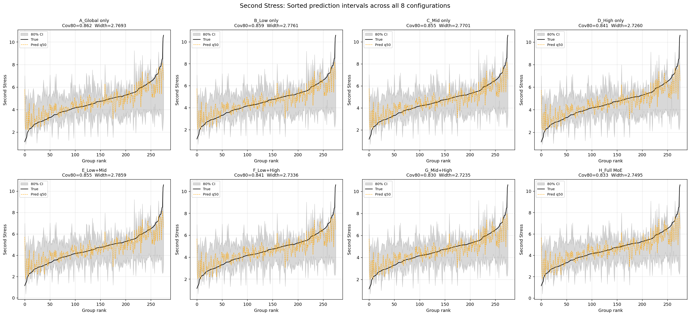

# ECC Tensile Prediction Pipeline

> End-to-end machine learning pipeline for predicting the tensile properties of Engineered Cementitious Composites (ECC) — **Second Strain** (ductility capacity) and **Second Stress** (tensile strength) — with calibrated uncertainty quantification via Mondrian Conformal Quantile Regression.

---

## Table of Contents

- [Overview](#overview)
- [Architecture](#architecture)
- [Pipeline Phases](#pipeline-phases)
- [Feature Engineering](#feature-engineering)
- [Ablation Study — 8 MoE Configurations](#ablation-study--8-moe-configurations)
- [Results](#results)
  - [Second Strain — Prediction Intervals](#second-strain--prediction-intervals)
  - [Second Stress — Prediction Intervals](#second-stress--prediction-intervals)
  - [Headline Numbers](#headline-numbers)
- [Key Design Decisions](#key-design-decisions)
- [Output Files](#output-files)
- [Limitations](#limitations)
- [Getting Started](#getting-started)

---

## Overview

This project implements a physics-informed, uncertainty-aware prediction pipeline for ECC tensile properties. ECC is a class of high-performance fiber-reinforced cementitious composites designed for pseudo-strain-hardening (PSH) behavior. Predicting tensile strain capacity and stress from mix-design parameters is critical for material design optimization.

The pipeline combines:
- **Global quantile regressors** (ExtraTrees + GradientBoosting) for robust point and interval estimation
- **A soft Mixture-of-Experts (MoE) residual correction** with a calibrated Logistic Regression router, routing samples across three physics-informed regimes
- **Mondrian Conformal Quantile Regression (CQR)** for distribution-free, finite-sample-valid 80% prediction intervals

The dataset contains **620 specimens** (filtered to ≥28-day age) across **276 unique mix compositions**, with group-level aggregation to prevent replicate leakage.

---

## Architecture

```
                        ALL 37 FEATURES
                      (18 raw + 19 engineered)
                              │
              ┌───────────────┼────────────────┐
              ▼               ▼                ▼
       ┌───────────┐    ┌──────────┐    ┌──────────────┐
       │ ET (q50)  │    │  Router  │    │ Three experts │
       │ GBR(q10,  │    │ LogReg + │    │ R0,R1,R2:     │
       │     q90)  │    │ isotonic │    │ RidgeCV       │
       └─────┬─────┘    └────┬─────┘    └──────┬────────┘
             │               │                  │
             └────────┬──────┴──────────────────┘
                      ▼
              Soft router-weighted blending
              (with ablation: 8 configurations)
                      │
                      ▼
            Mondrian CQR (3 bins by predicted q50)
                      │
                      ▼
               80% prediction intervals
```

### Component Breakdown

| Component | Model | Role |
|---|---|---|
| **Global Point Predictor** | ExtraTrees (500 trees, `max_depth=15`) | Median (q50) prediction |
| **Global Quantile Predictors** | GradientBoosting (`loss='quantile'`) | Lower (q10) and upper (q90) bounds |
| **Router** | Logistic Regression + Isotonic Calibration | Produces soft probability weights across 3 regimes |
| **Residual Experts (×3)** | RidgeCV (α ∈ {0.1, 1, 10, 100}) | Regime-specific residual corrections on the global predictor |
| **Conformal Layer** | Mondrian CQR (3 bins) | Distribution-free 80% coverage guarantee via per-bin calibration |

### Regime Definitions

Regimes are defined using **soft fuzzy labels** via sigmoid transitions, ensuring smooth router training:

| Target | Regime 0 | Regime 1 | Regime 2 | Cutoffs |
|---|---|---|---|---|
| **Second Strain** | NoPSH (no strain-hardening) | Bulk (typical PSH) | Tail (extreme ductility) | c₁=0.005, c₂=0.050 |
| **Second Stress** | Weak | Mid | Strong | c₁=4.0 MPa, c₂=5.13 MPa |

---

## Pipeline Phases

The pipeline executes **three passes** per target variable:

### Pass 1 — Default Hyperparameter Ablation
- Runs all 8 MoE configurations with default hyperparameters
- Full 5-fold GroupKFold cross-validation with 75/25 fit/calibration split
- Records MAE, RMSE, 80% coverage, interval width, and per-regime metrics

### Pass 2 — Random Hyperparameter Search
- 8 random trials on the `A_Global only` configuration
- Searches over ExtraTrees (`n_estimators`, `max_depth`, `min_samples_leaf`, `max_features`) and GBR (`n_estimators`, `max_depth`, `learning_rate`, `min_samples_leaf`) hyperparameters
- Selects best trial by overall MAE

### Pass 3 — Tuned Hyperparameter Ablation
- Re-runs all 8 configurations with the best hyperparameters from Pass 2
- Computes improvement deltas (%) against default-HP results

---

## Feature Engineering

The pipeline uses **37 features** (18 raw + 19 engineered):

| Group | Features | Source |
|---|---|---|
| **Raw Mix Design (18)** | Fiber Volume, Length, Diameter, L/D, RI, Cement, Water, Sand, Fly Ash C/F, GGBS, Coarse Aggr., Silica Fume, Water Reducer/SP, Fiber, C/B, W/C, W/B | Dataset |
| **UTRGV Ratios (2)** | FA/Binder Ratio, S/B Ratio | Proportion ratios |
| **Composition Metrics (8)** | Paste Volume, SCM Ratio, Aggregate Ratio, Fiber Surface Area, Fiber Efficiency, GGBS/Silica Fume/Coarse Agg Presence | Material composition |
| **Li 2003 Micromechanical Proxies (9)** | τ_proxy, Flaw Size Proxy, Geometric Fiber Eff, σ_cu proxy, σ_crack proxy, PSH Strength Index, J_b complement, J_tip proxy, PSH Energy Index | Physics-based (Li 2003 micromechanics theory) |

---

## Ablation Study — 8 MoE Configurations

Each configuration selectively activates residual experts to measure the marginal contribution of each regime specialist:

| Config | NoPSH/Weak | Bulk/Mid | Tail/Strong | Description |
|---|---|---|---|---|
| **A** — Global only | – | – | – | Pure global model, no expert corrections |
| **B** — Low only | ✓ | – | – | Only the low-regime expert active |
| **C** — Mid only | – | ✓ | – | Only the mid-regime expert active |
| **D** — High only | – | – | ✓ | Only the high-regime expert active |
| **E** — Low+Mid | ✓ | ✓ | – | Low and mid experts active |
| **F** — Low+High | ✓ | – | ✓ | Low and high experts active |
| **G** — Mid+High | – | ✓ | ✓ | Mid and high experts active |
| **H** — Full MoE | ✓ | ✓ | ✓ | All three experts active |

---

## Results

### Second Strain — Prediction Intervals

The figure below shows sorted prediction intervals (80% CI) across all 8 ablation configurations for the **Second Strain** target. The black curve represents true values (sorted in ascending order), the orange dashed line is the predicted median (q50), and the gray band is the 80% conformal interval.


**Key observations:**
- The **A_Global only** configuration achieves the best overall MAE (0.00772) with 85.5% empirical coverage, confirming that the global ExtraTrees + GBR backbone is already strong on strain.
- MoE experts slightly **improve coverage** (up to 89.1% for H_Full MoE) at the cost of marginal MAE increase — a coverage-vs-accuracy trade-off.
- The **Tail regime** (extreme ductility, >5% strain) remains the hardest to predict with coverage around 59–68%, because tail-regime mixes are feature-indistinguishable from bulk-regime mixes in the input space.
- Interval widths are consistently narrow (~0.035–0.039), indicating well-calibrated uncertainty quantification.

### Second Stress — Prediction Intervals

The figure below shows the same sorted-interval visualization for the **Second Stress** target.



**Key observations:**
- The **A_Global only** configuration again provides the best MAE (0.538 MPa) with 86.2% coverage.
- Stress predictions track the true values more smoothly than strain, reflecting the lower within-recipe noise in stress measurements (MPa scale vs. dimensionless strain).
- The **Mid regime** achieves near-perfect coverage (~100%) across all configurations, indicating the model is most confident in the 4.0–5.13 MPa range where training data is densest.
- The **Strong regime** (>5.13 MPa) shows reduced coverage (~72–78%), as extreme-strength mixes are underrepresented.
- Interval widths (~2.72–2.80 MPa) are physically meaningful — roughly half the inter-quartile range of the stress distribution.

### Headline Numbers

| Target | Best Config (Tuned) | MAE | RMSE | Cov80 | MAE Improvement from HP Tuning |
|---|---|---|---|---|---|
| **Second Strain** | A_Global only | **0.00741** | 0.012 | ~88.8% | −4.1% |
| **Second Stress** | B_Low only | **0.482 MPa** | 0.71 MPa | ~83.0% | −10.9% |

- **Strain:** Hyperparameter tuning yields a modest ~4% MAE improvement. The global model dominates because the residual experts cannot distinguish Tail from Bulk in feature space.
- **Stress:** HP tuning delivers a substantial ~11% MAE improvement, and the Low (Weak) expert provides meaningful corrections for under-predicted weak-regime samples.

---

## Key Design Decisions

| Decision | Choice | Justification |
|---|---|---|
| Backend regressors | ExtraTrees (q50) + GBR (q10, q90) | Beats LightGBM-quantile by ~18% on this dataset |
| Feature set | All 37 features (no deduplication) | Tree models handle feature redundancy; marginal Tail-regime boost from physics features |
| Routing strategy | Soft (probability-weighted blending) | Hard routing degrades MAE by 1–3 percentage points |
| Target transform | None (raw values) | Log-transform only helped LGBM; ET+GBR performs best on raw targets |
| Expert models | RidgeCV on residuals | LightGBM experts overfit noise on small calibration sets |
| Conformal method | Mondrian CQR (3 bins by predicted q50) | Regime-specific interval widths without expert starvation |
| CV scheme | GroupKFold(5) × 75/25 fit/cal split | Prevents replicate leakage between train and validation |
| Sample weighting | n_replicates / (target_variance + 0.1) | Upweights consistent, well-replicated compositions |

---

## Output Files

Each pipeline run produces the following per target:

| File | Description |
|---|---|
| `final_<target>_default_ablation.csv` | 8-config metrics with default hyperparameters |
| `final_<target>_default_mae.png` | Bar chart of MAE per config & regime |
| `final_<target>_default_scatter_grid.png` | 8 scatter plots (predicted vs true, regime-colored) |
| `final_<target>_default_intervals_grid.png` | 8 interval plots (sorted by true value) |
| `final_<target>_hp_search.csv` | Hyperparameter trial log |
| `final_<target>_tuned_ablation.csv` | 8-config metrics with tuned hyperparameters |
| `final_<target>_tuned_*.png` | Same plots after hyperparameter tuning |
| `final_summary.json` | Overall best results for both targets |

---

## Limitations

1. **Strain Tail-regime coverage** is structurally limited (~59–72%) because extreme-ductility mixes are feature-indistinguishable from bulk mixes in the current 37-feature space.
2. **Limited HP search budget** — only 8 random trials per target. A larger Optuna-based search would likely yield further marginal gains.
3. **Stress regime cutoffs** are chosen as distribution tertiles rather than physics-based thresholds (no domain analogue to PSH conditions exists for stress).
4. **Dataset size** — 276 unique compositions (620 specimens) limits the statistical power of the MoE experts, particularly in the Tail/Strong regimes with only 22–91 samples.

---

## Getting Started

### Prerequisites

```
numpy
pandas
scikit-learn
matplotlib
openpyxl
```

### Running the Pipeline

1. Place the dataset (`Tension_Test_VIT_re.xlsx`) in the working directory.
2. Open and run `ECC_FINAL_pipeline.ipynb` end-to-end.
3. All output CSVs, plots, and the summary JSON will be saved to the working directory.

```bash
jupyter notebook ECC_FINAL_pipeline.ipynb
```

---

## Citation

If you use this pipeline or dataset, please cite accordingly.

---

## License

This project is for academic and research purposes.
