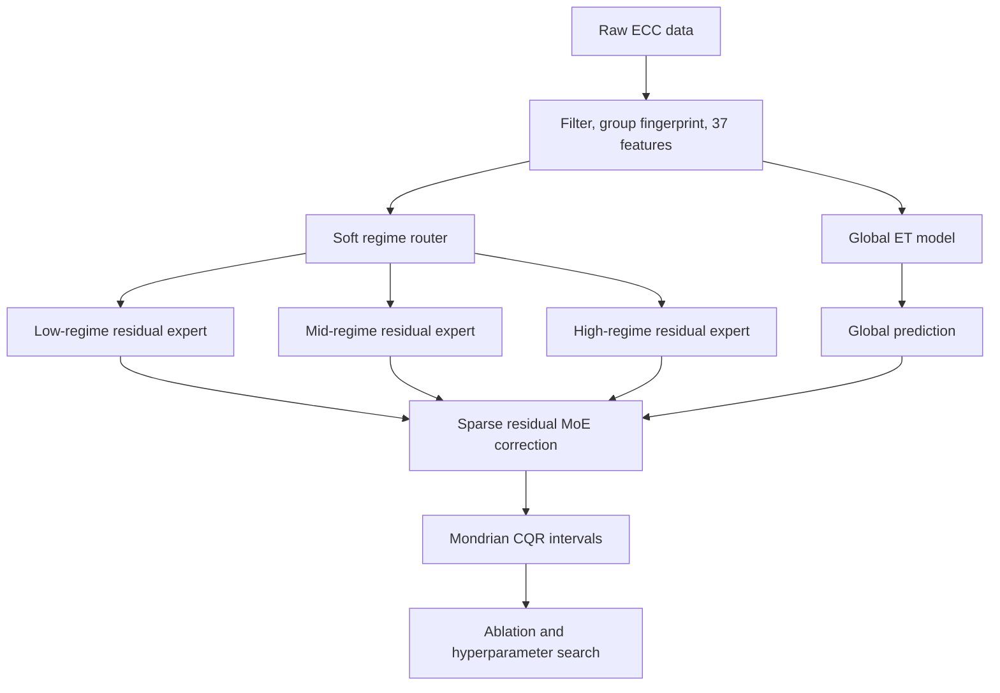
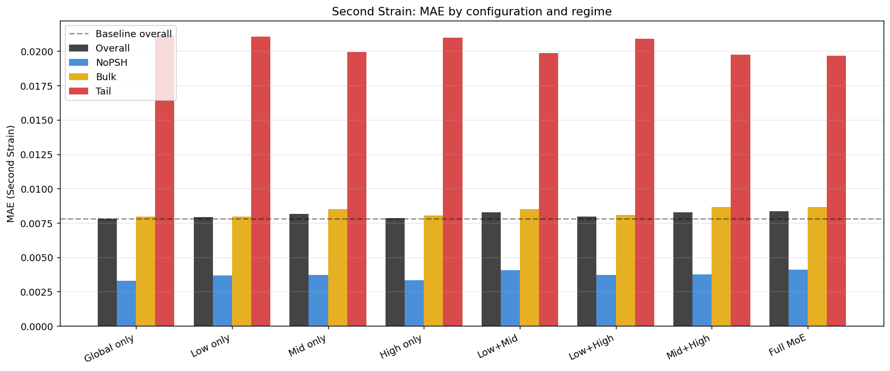
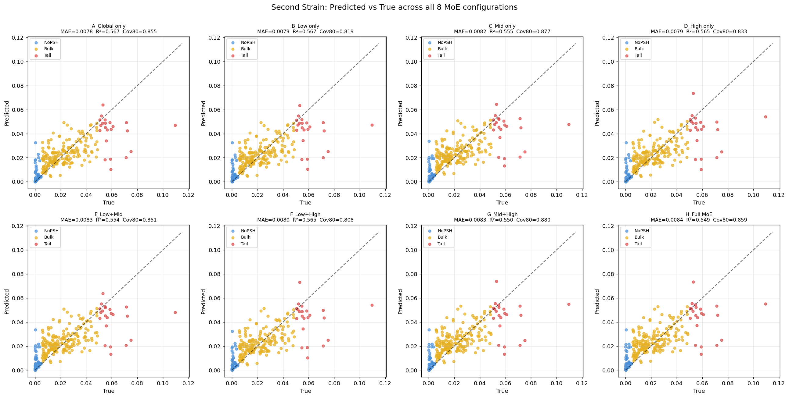
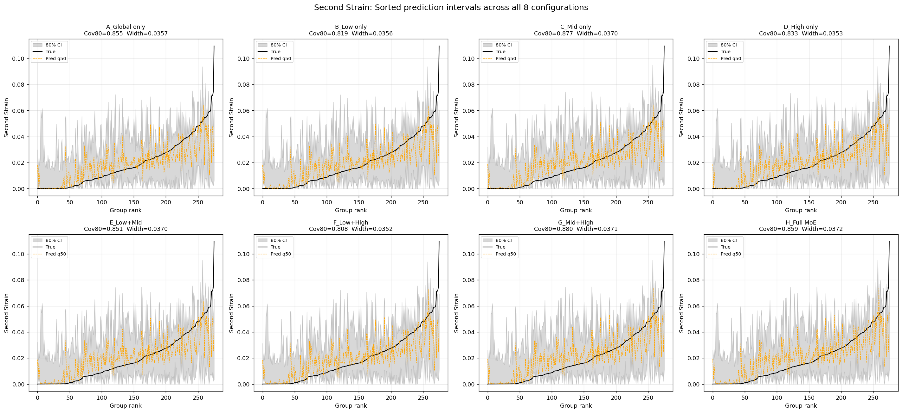
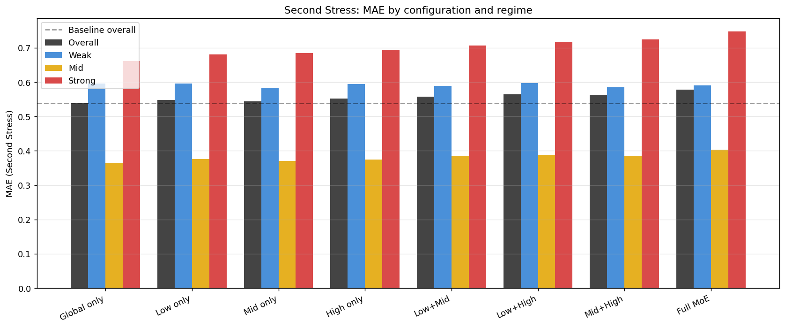
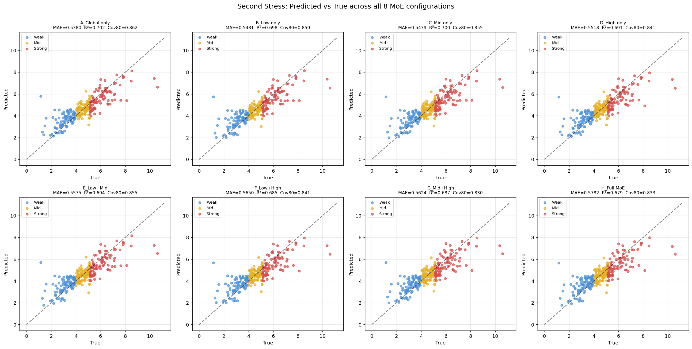

# ECC Final Consolidated Pipeline

Notebook: `ECC_FINAL_pipeline.ipynb`

## Architecture Diagram

## Methods

This is the final forward-only consolidated pipeline. It uses an ExtraTrees global model, GradientBoosting/Ridge-style residual correction experts, soft fuzzy regime labels, and Mondrian CQR. It runs ablations over eight expert combinations, then performs random hyperparameter search.

Unlike the inverse notebooks, this notebook focuses on the forward architecture and model comparison. There is no full inverse-design pipeline here.

## Results

Final summary from executed outputs:

| Target | Default best config | Default MAE | Default R2 | Tuned best config | Tuned MAE | Tuned R2 |
|---|---|---:|---:|---|---:|---:|
| Second Strain | A_Global only | 0.007798 | 0.567285 | A_Global only | 0.007457 | 0.531108 |
| Second Stress | A_Global only | 0.537959 | 0.701732 | B_Low only | 0.486572 | 0.752914 |

The tuned stress result is among the strongest stress MAE values in this repository. For strain, the tuned MAE improves over the default pass, but R2 is lower than the default best configuration, so the better choice depends on whether MAE or explained variance is the priority.

## Graphs

