# ECC Pipeline Combined - Detailed Explanation

Notebook: `ECC_Pipeline_Combined.ipynb`

This notebook is the most complete implementation in the project. It combines:

- a forward prediction pipeline for ECC tensile stress and strain,
- calibrated uncertainty intervals,
- a multi-version inverse design pipeline,
- an OOD-aware inverse optimization patch,
- recommendation plots and diagnostic plots.

The forward model used by all inverse sections in this notebook is the same CatBoost + Mondrian CQR model trained inside `ECC_Pipeline_Combined.ipynb`.

## Full Architecture

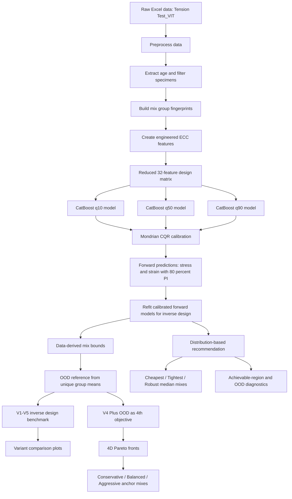

## 1. Preprocessing

The notebook starts by loading the raw ECC tension-test dataset from Excel:

```text
data/Tension Test_VIT_re.xlsx
sheet: Tension Test_VIT
```

The preprocessing does four important things.

| Step | What it does | Why it matters |
|---|---|---|
| Column cleanup | Renames `Water Reducer / SP` to `Water Reducer/SP` | Keeps feature names consistent |
| Age extraction | Extracts curing age from `Specimen` or `Mixture` text | Removes early-age tests that are not comparable |
| Age filtering | Drops specimens with explicit age less than 28 days | Keeps mature ECC behavior |
| Group fingerprinting | Creates `group_id` from mix composition | Prevents replicate leakage during cross-validation |

The group fingerprint is important because many rows are replicate tests of the same mixture. If one replicate appears in training and another in testing, the score becomes too optimistic. This notebook uses group-aware splitting so the same mix does not leak across folds.

## 2. Feature Engineering

The model does not train only on raw ingredient quantities. It builds a richer ECC feature space from mixture composition, fiber parameters, ratio features, and micromechanical indicators.

The original full set has 37 features. This combined notebook uses the Reduced A feature set with 32 features after removing correlation-redundant features.

### Feature Groups

| Group | Examples | Purpose |
|---|---|---|
| Raw ingredients | Cement, Water, Sand, Fly ash C, Fly ash F, GGBS, Silica Fume, Water Reducer/SP | Direct mix-design variables |
| Fiber descriptors | Fiber volume, length, diameter, L/D, RI | Capture fiber bridging contribution |
| Binder and ratio features | Binder content, water/binder, SCM ratio, sand/binder | Normalize mix proportions |
| ECC micromechanics proxies | PSH strength and energy indicators | Approximate pseudo-strain-hardening tendency |
| UTRGV-style ratios | FA/binder, S/binder | Domain-specific composition summaries |

The feature logic is designed so every candidate mix in the inverse pipeline can be converted back into the same model feature format using `build_feature_row`.

## 3. Forward Model Training

The forward model predicts two targets:

| Target | Meaning | Unit in interpretation |
|---|---|---|
| `Second Stress` | Tensile strength | MPa |
| `Second Strain` | Tensile ductility | fraction internally, percent in plots/tables |

For each target, the notebook trains three CatBoost models:

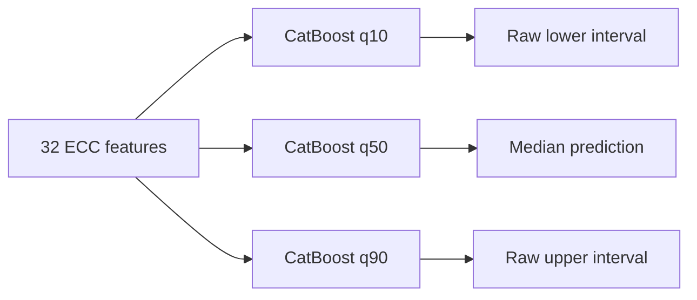

The models are quantile regressors:

- `q10` estimates the lower prediction quantile,
- `q50` estimates the median prediction,
- `q90` estimates the upper prediction quantile.

The notebook uses 5-fold `GroupKFold`, so evaluation is honest at the mix level.

## 4. Mondrian CQR Calibration

CatBoost gives raw quantile intervals, but raw intervals are not always calibrated. The notebook applies Mondrian Conformalized Quantile Regression.

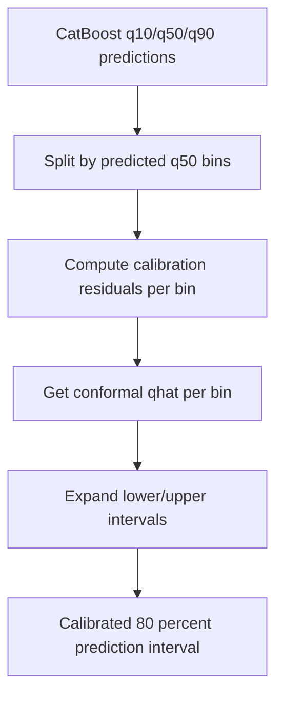

Mondrian calibration means the conformal correction is computed separately inside predicted-performance bins. This helps avoid one global interval width being applied to all mixes.

### Forward Results

| Target | MAE | RMSE | R2 | Cov80 | Width80 |
|---|---:|---:|---:|---:|---:|
| Second Stress | 0.5013 MPa | 0.7387 MPa | 0.7405 | 0.880 | 2.2825 MPa |
| Second Strain | 0.0076 | 0.0122 | 0.5599 | 0.862 | 0.0306 |

Interpretation:

- Stress prediction is fairly strong, with R2 around 0.74 and MAE around 0.50 MPa.
- Strain is harder because ductility has higher experimental scatter, but MAE remains around 0.76 percentage points.
- Coverage is above the nominal 80 percent target for both outputs, so the calibrated intervals are conservative rather than underconfident.

## 5. Forward Diagnostic Plot

The forward diagnostic figure is saved as:

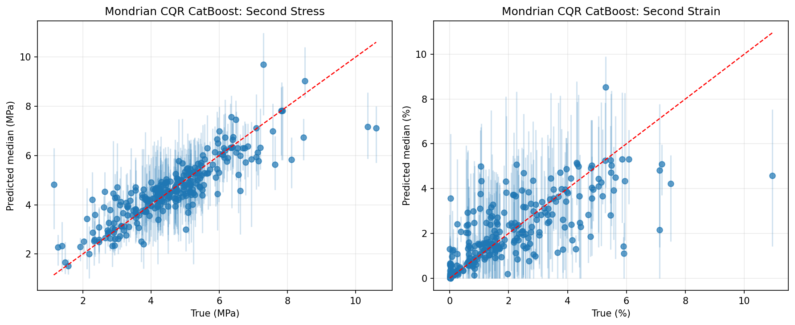

This plot compares predicted vs actual stress and strain.

What to look for:

- Points close to the diagonal mean accurate prediction.
- Wider spread means harder target behavior.
- Strain usually shows more scatter than stress, which matches the numerical results.

## 6. Inverse Pipeline Setup

After training the forward model, the notebook switches from prediction to design.

The inverse problem is:

> Find ECC mix compositions that satisfy target stress and strain ranges while keeping cost, uncertainty, and OOD risk under control.

### Data-Derived Bounds

Instead of allowing unrealistic ingredient ranges, the notebook creates bounds from the training data:

| Ingredient | Lower | Upper |
|---|---:|---:|
| Cement | 225.0 | 1413.7 |
| Water | 72.8 | 507.0 |
| Sand | 0.0 | 1076.0 |
| Fly ash C | 0.0 | 934.0 |
| Fly ash F | 0.0 | 1099.2 |
| GGBS | 0.0 | 1016.0 |
| Coarse Aggregate | 0.0 | 0.0 |
| Silica Fume | 0.0 | 215.0 |
| Water Reducer/SP | 0.0 | 40.4 |

Training rows inside bounds: 525 / 620, or 84.7 percent.

Coarse aggregate is locked at zero to match ECC convention in this implementation.

### Fiber and Binder Assumptions

The notebook uses a fixed PVA REC15 fiber design:

- fiber volume fraction: 2 percent,
- fixed fiber cost: 143.00 USD/m3,
- binder cap: 1692.9 kg/m3.

The PSH check is performed at the fixed fiber-design level:

| Quantity | Value |
|---|---:|
| Bridging stress `sigma_cu` | 7.33 MPa |
| Estimated first-crack stress `sigma_fc` | 4.00 MPa |
| Ratio | 1.83 |
| Required ratio | at least 1.2 |

So PSH is considered satisfied at the fiber-design level and is not enforced as a per-mix constraint in the active pipeline.

## 7. Forward Models for Inverse Design

The inverse section refits calibrated q10/q50/q90 CatBoost models using a 75/25 fit/calibration split. These models expose prediction helpers that return:

- median stress,
- median strain,
- lower and upper calibrated stress interval,
- lower and upper calibrated strain interval.

The inverse optimizer uses those interval outputs directly, not just point predictions.

## 8. OOD Reference

OOD means out-of-distribution. A mix can look good according to the model but be far away from the training data. That is risky.

The notebook builds an OOD reference using k-nearest-neighbor distance on deduplicated group-mean compositions. This avoids replicate rows making the training distribution look artificially dense.


OOD is used in two ways:

- V5 filters V4 solutions by OOD threshold.
- V4 Plus OOD includes OOD distance as an optimization objective.

## 9. V1-V5 Inverse Benchmark

The notebook tests five inverse-design strategies over three target queries.

### Target Queries

| Query | Stress target | Strain target |
|---|---:|---:|
| Easy | 3.0-5.0 MPa | 1.0-3.0 percent |
| Medium | 4.0-6.0 MPa | 2.0-5.0 percent |
| Hard | 5.0-7.0 MPa | 3.0-6.0 percent |

### Variants

| Variant | Method | Main idea |
|---|---|---|
| V1 Random | Random sampling | Baseline brute-force search |
| V2 NSGA Unconstrained | NSGA-II | Multi-objective optimization without physics/uncertainty constraints |
| V3 NSGA Physics | NSGA-II + physics/binder constraints | Adds practical mix constraints |
| V4 NSGA Uncertainty | NSGA-II + uncertainty propagation | Requires calibrated intervals to satisfy target bounds |
| V5 NSGA Uncertainty OOD | V4 + OOD filtering | Keeps only in-distribution V4 candidates |

### Inverse Benchmark Results

| Query | Variant | Feasible | Cost Min | Cost Max | Stress Range | Strain Range | Mean Stress Width | Mean Strain Width | In-Dist |
|---|---|---:|---:|---:|---|---|---:|---:|---:|
| Easy | V1 Random | 78,875 | 237.401 | 831.420 | 3.047-5.000 | 1.000-3.000 | 2.631 | 0.049 | 1.002 percent |
| Easy | V2 NSGA | 57 | 211.719 | 267.252 | 3.800-4.983 | 1.611-2.968 | 2.333 | 0.039 | 1.754 percent |
| Easy | V3 Physics | 46 | 211.723 | 256.298 | 3.800-4.965 | 1.873-2.983 | 2.249 | 0.044 | 4.348 percent |
| Easy | V4 Uncertainty | 200 | 231.562 | 330.409 | 3.869-4.600 | 1.235-2.602 | 1.410 | 0.012 | 100 percent |
| Easy | V5 OOD | 200 | 231.562 | 330.409 | 3.869-4.600 | 1.235-2.602 | 1.410 | 0.012 | 100 percent |
| Medium | V1 Random | 96,734 | 237.401 | 831.420 | 4.000-5.308 | 2.000-4.134 | 2.652 | 0.051 | 0.677 percent |
| Medium | V2 NSGA | 181 | 212.501 | 644.621 | 4.036-5.803 | 2.008-4.389 | 2.647 | 0.051 | 19.337 percent |
| Medium | V3 Physics | 190 | 212.501 | 363.142 | 4.039-5.803 | 2.024-4.083 | 2.390 | 0.052 | 33.158 percent |
| Medium | V4 Uncertainty | 200 | 233.539 | 285.028 | 4.381-5.223 | 2.149-3.847 | 1.420 | 0.021 | 100 percent |
| Medium | V5 OOD | 200 | 233.539 | 285.028 | 4.381-5.223 | 2.149-3.847 | 1.420 | 0.021 | 100 percent |
| Hard | V1 Random | 524 | 303.335 | 791.392 | 5.000-5.266 | 3.000-4.084 | 3.185 | 0.058 | 0.763 percent |
| Hard | V2 NSGA | 68 | 294.875 | 644.621 | 5.004-5.490 | 3.025-4.156 | 3.075 | 0.057 | 4.412 percent |
| Hard | V3 Physics | 42 | 259.649 | 363.142 | 5.001-5.493 | 3.000-3.833 | 2.746 | 0.058 | 21.429 percent |
| Hard | V4 Uncertainty | 0 | n/a | n/a | n/a | n/a | n/a | n/a | n/a |
| Hard | V5 OOD | 0 | n/a | n/a | n/a | n/a | n/a | n/a | n/a |

Main interpretation:

- Random search finds many q50-feasible candidates, but almost all are OOD.
- V4 gives fewer but much more reliable candidates because it uses interval constraints.
- V5 does not change Easy/Medium here because V4 solutions are already in-distribution.
- Hard targets are not achievable once uncertainty constraints are enforced.

### Variant Comparison Figure

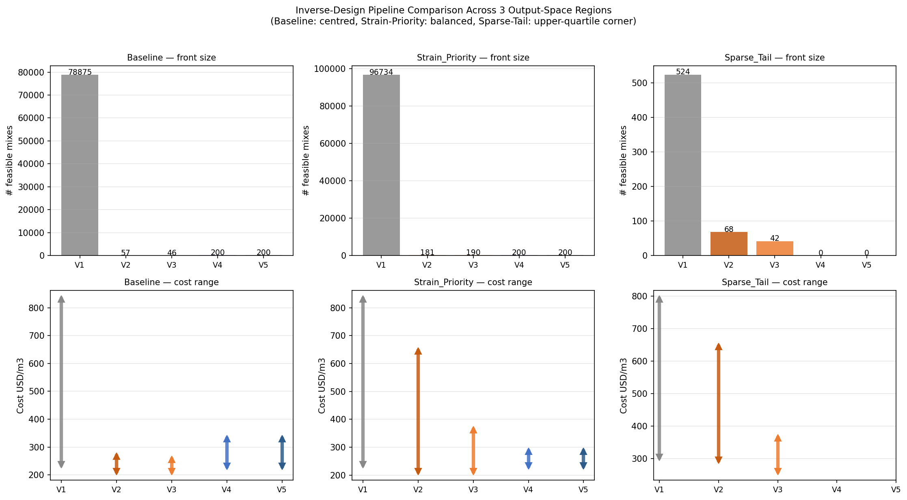

This figure summarizes front size and cost range for each variant and query.

What to look for:

- V1 has huge front sizes because it accepts q50 feasibility.
- V4/V5 have smaller, cleaner, more reliable fronts.
- Hard query collapses under V4/V5, showing that the model cannot confidently certify that target region.

## 10. V4 Plus OOD Patch

The notebook then adds a stronger inverse formulation: `V4_PlusOOD`.

Instead of filtering OOD after optimization, it makes OOD distance a fourth objective.

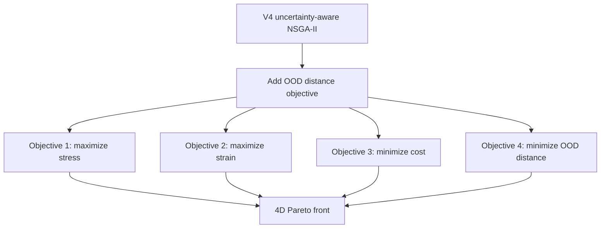

It also adds an ECC baseline strain condition: the lower calibrated strain interval must be at least 1 percent.

### V4 vs V4 Plus OOD Results

| Query | Variant | n | Cost Min | Cost Max | Mean Stress Width | In-Dist |
|---|---|---:|---:|---:|---:|---:|
| Easy | V4 original | 200 | 231.56 | 330.41 | 1.41 | 100.0 percent |
| Easy | V4 Plus OOD | 200 | 235.79 | 315.09 | 1.35 | 100.0 percent |
| Medium | V4 original | 200 | 233.54 | 285.03 | 1.42 | 100.0 percent |
| Medium | V4 Plus OOD | 200 | 233.77 | 287.63 | 1.32 | 90.0 percent |
| Hard | V4 original | 0 | n/a | n/a | n/a | n/a |
| Hard | V4 Plus OOD | 0 | n/a | n/a | n/a | n/a |

Interpretation:

- Easy query: V4 Plus OOD keeps 200 solutions, narrows the upper cost range, and slightly reduces mean stress interval width.
- Medium query: V4 Plus OOD also keeps 200 solutions and slightly reduces stress uncertainty, but 10 percent of the front is outside the p95 OOD threshold.
- Hard query: no feasible solutions, so the hard design target should not be presented as certified by this model.

### 4D Pareto Figure

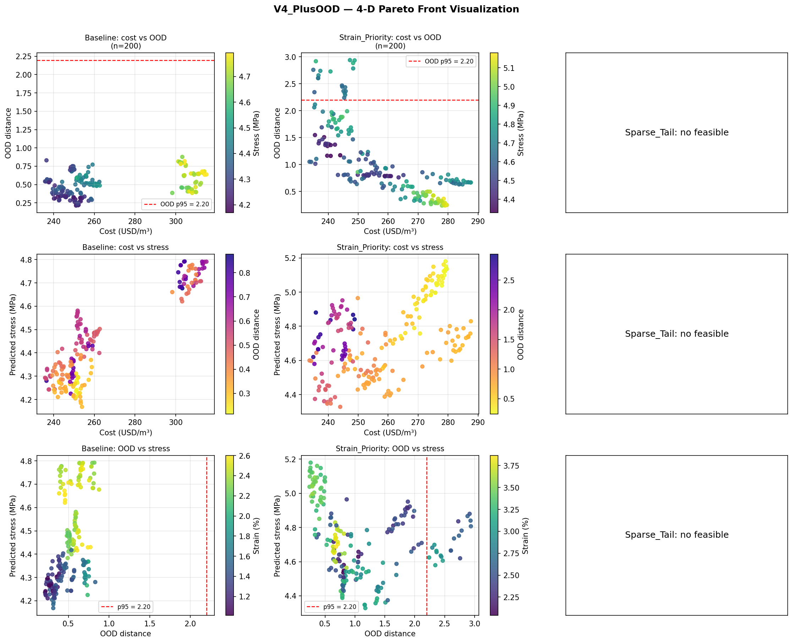

This figure shows three slices of the 4D Pareto front:

- cost vs OOD distance,
- cost vs stress,
- OOD distance vs stress.

The purpose is to reveal whether better performance requires moving away from known training-data regions.

## 11. Anchor Mixes from V4 Plus OOD

The notebook extracts three representative mixes from the 4D Pareto front:

| Anchor | Meaning |
|---|---|
| Conservative | Minimum OOD distance; closest to known data |
| Balanced | Median-cost in-distribution solution |
| Aggressive | Highest stress among in-distribution solutions |

### Easy Query Anchors

| Anchor | Cost | Stress q50 and PI | Strain q50 and PI | OOD |
|---|---:|---|---|---:|
| Conservative | 251.0 USD/m3 | 4.24 MPa [3.63, 5.00] | 1.10 percent [1.00, 2.05] | 0.21 |
| Balanced | 252.3 USD/m3 | 4.22 MPa [3.60, 4.97] | 1.25 percent [1.25, 1.90] | 0.22 |
| Aggressive | 304.4 USD/m3 | 4.79 MPa [3.59, 4.79] | 2.28 percent [1.14, 2.97] | 0.82 |

### Medium Query Anchors

| Anchor | Cost | Stress q50 and PI | Strain q50 and PI | OOD |
|---|---:|---|---|---:|
| Conservative | 278.0 USD/m3 | 5.04 MPa [4.25, 5.84] | 3.41 percent [2.08, 4.99] | 0.24 |
| Balanced | 258.8 USD/m3 | 4.39 MPa [4.08, 5.19] | 3.23 percent [2.44, 4.90] | 0.79 |
| Aggressive | 279.2 USD/m3 | 5.18 MPa [4.35, 5.99] | 3.30 percent [2.11, 4.73] | 0.26 |

The Hard query has no feasible V4 Plus OOD front.

## 12. Distribution-Based Recommendation

The recommendation section uses random sampling to estimate the design distribution for the broad target:

```text
Stress: 3.0-6.0 MPa
Strain: 2.0-5.0 percent
```

It separates:

- q50-feasible mixes: median prediction is inside target box,
- certifying mixes: full calibrated 80 percent interval is inside target box.

### Recommendation Results

| Quantity | Value |
|---|---:|
| Samples | 100,000 |
| q50-feasible mixes | 9,291 |
| Certifying mixes | 57 |
| Certifying share of feasible | 0.6 percent |
| Median feasible cost | 403.4 USD/m3 |
| IQR feasible cost | 360.4-457.4 USD/m3 |
| 5-95 percent feasible cost | 310.0-543.2 USD/m3 |
| Min-max feasible cost | 237.4-688.2 USD/m3 |

Key recommendation examples:

| Mix | Cost | Compliance | OOD | Notes |
|---|---:|---|---:|---|
| Cheapest q50-feasible | 237.4 USD/m3 | q50 only, interval fails | 2.72 | Cheap but out-of-distribution and not robust |
| Tightest certifying | 457.9 USD/m3 | 80 percent PI fits target | 1.99 | Robust but expensive |
| Robust-median certifying | 418.6 USD/m3 | 80 percent PI fits target | 1.28 | Best balanced recommendation |

The robust-median certifying mix is usually the most defensible recommendation because it satisfies the interval constraint and is not the most expensive solution.

### Recommendation Figure

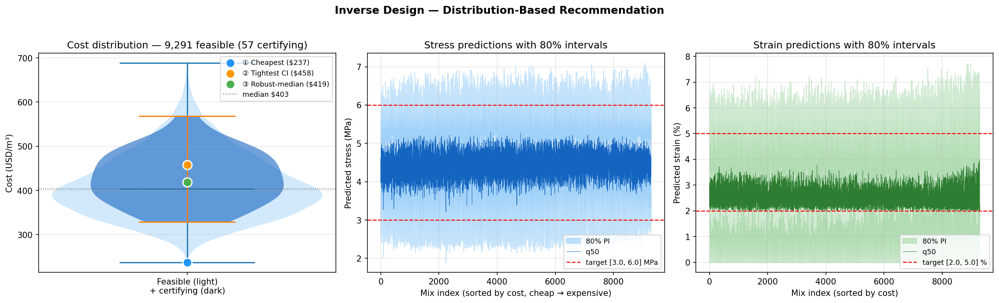

This figure shows the feasible-cost distribution and the selected anchor recommendations.

What to look for:

- The cheapest q50-feasible mix is not necessarily safe.
- The certifying mixes are rare.
- Robust mixes tend to cost more because the full uncertainty interval must stay inside the target box.

## 13. Achievable-Region Diagnostic

The achievable-region diagnostic samples 50,000 random mixes under the active bounds and binder cap.

Results:

| Quantity | Value |
|---|---:|
| Random samples | 50,000 |
| Binder-feasible samples | 5,607 |
| Achievable stress q50 range | 3.30-5.27 MPa |
| Achievable strain q50 range | 0.46-3.61 percent |
| Mean stress q50 | 4.41 MPa |
| Mean strain q50 | 2.37 percent |

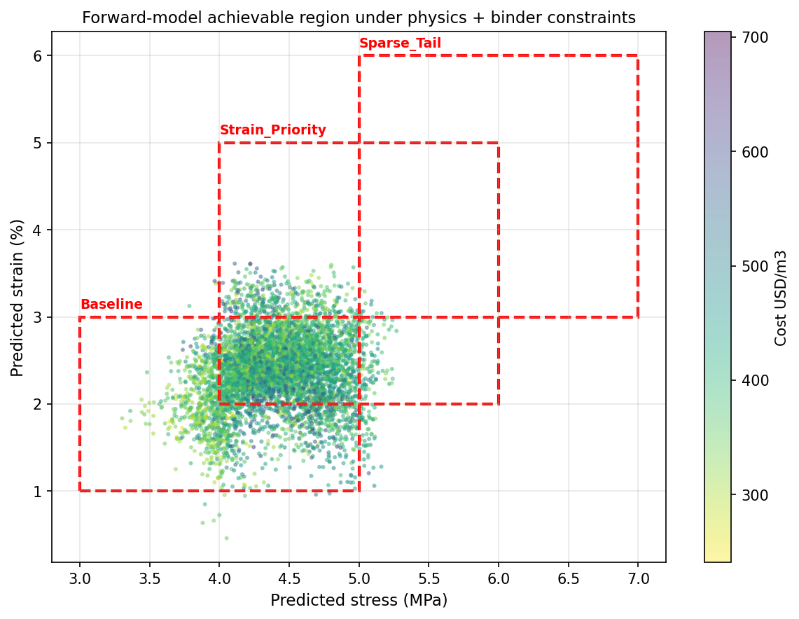

Interpretation:

- The hard target asks for up to 7 MPa stress and 6 percent strain.
- The sampled feasible region only reaches about 5.27 MPa stress and 3.61 percent strain by q50.
- This explains why V4/V5 and V4 Plus OOD return no hard-query solutions.

## 14. OOD Distribution Diagnostic

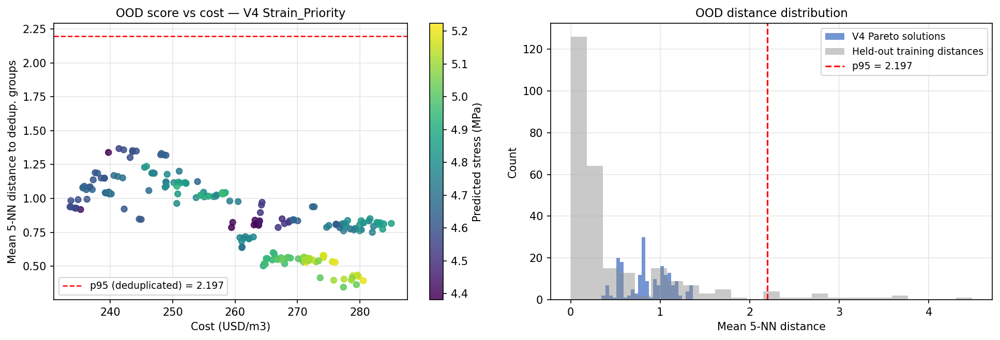

The OOD diagnostic checks whether Pareto solutions are close to known training compositions.

Captured result:

```text
V4 Pareto in-distribution (<= p95): 200 / 200 (100.0 percent)
```

This supports the Medium V4 result: the optimized solutions are not just mathematically feasible, they are also close to the empirical mix-design distribution.

## 15. Disabled PSH Diagnostics

The notebook contains older PSH recalibration and sensitivity sections, but they are disabled in the active implementation.

Reason:

- Earlier versions tried to enforce PSH as a per-mix proxy.
- The combined notebook instead verifies PSH at the fixed PVA fiber-design level.
- This avoids over-constraining the optimizer with a noisy per-mix proxy.

The old image files may still exist:

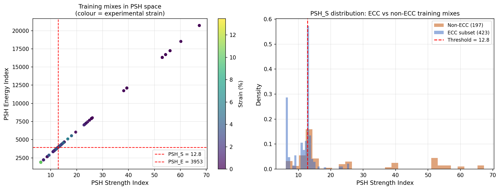

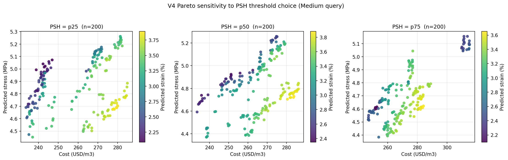

They are useful as historical diagnostics, but not part of the active decision logic in this notebook.

## 16. Final Takeaways

| Question | Answer from this notebook |
|---|---|
| Which forward model is used? | CatBoost quantile regressors plus Mondrian CQR |
| Is evaluation group-safe? | Yes, the notebook uses group fingerprints and GroupKFold |
| Why use uncertainty intervals? | To avoid recommending mixes whose median prediction is good but uncertainty spills outside the target |
| Which inverse variant is most reliable? | V4/V5 for normal benchmark, V4 Plus OOD for OOD-aware Pareto search |
| What target is safest? | Easy and Medium targets are certifiable; Hard target is not |
| Best practical recommendation style? | Use certifying mixes, especially robust-median certifying mix |
| Main risk in cheap mixes? | They can be q50-feasible but fail interval certification and/or be out-of-distribution |

## Suggested Reading Order

1. Preprocessing and feature engineering cells.
2. CatBoost Mondrian-CQR diagnostic training.
3. Inverse setup: bounds, binder cap, fiber cost, OOD reference.
4. V1-V5 inverse benchmark table.
5. V4 Plus OOD patch and Pareto plot.
6. Distribution-based recommendation.
7. Achievable-region and OOD diagnostics.

