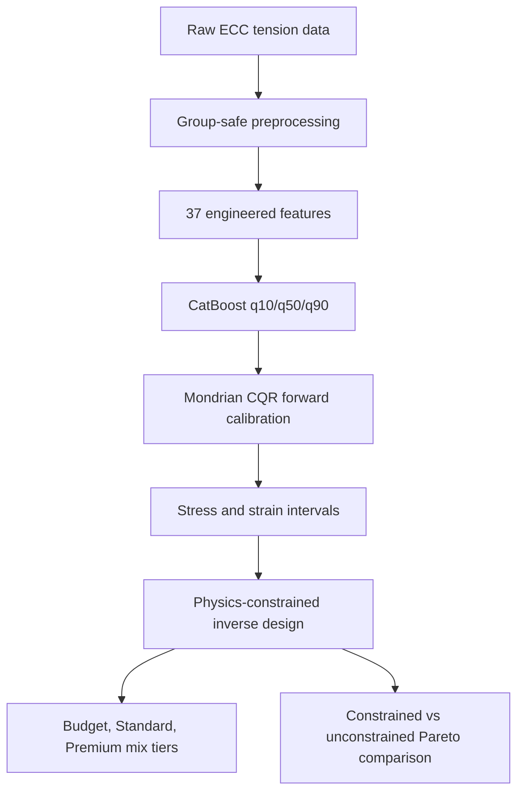

# ECC Pipeline with Inverse Design

Notebook: `ECC_Pipeline_with_Inverse.ipynb`

## Architecture Diagram

## Methods

This notebook extends the CatBoost + Mondrian CQR forward model with an explicit inverse-design workflow. The inverse pipeline uses the forward model from this same notebook to evaluate candidate ECC mixes.

The inverse objective is to find mixes that meet target stress and strain windows while minimizing material cost. It compares unconstrained candidates with physics-constrained candidates that include pseudo-strain-hardening proxy constraints.

## Results

Forward-model metrics:

| Target | MAE | RMSE | R2 | Cov80 | Width80 |
|---|---:|---:|---:|---:|---:|
| Second Stress | 0.5090 MPa | 0.7458 MPa | 0.7355 | 0.851 | 2.2069 MPa |
| Second Strain | 0.0075 | 0.0125 | 0.5358 | 0.873 | 0.0319 |

The physics-constrained Pareto front produced 200 solutions with a cost range of about 97.5-227.6 USD/m3. The tiered random-search inverse section found 24,766 feasible candidates out of 100,000 sampled candidates.

## Graphs

