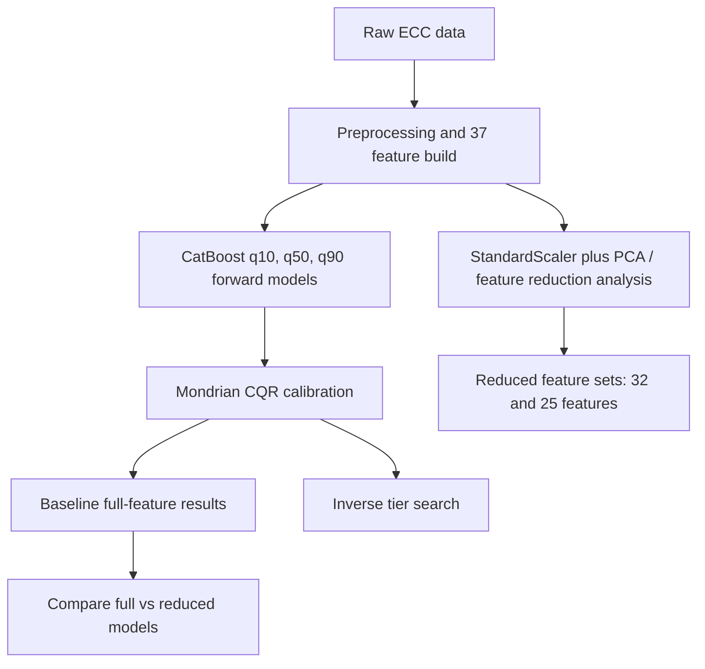

# ECC Pipeline with PCA

Notebook: `ECC_Pipeline_with_PCA.ipynb`

## Architecture Diagram

## Methods

This notebook starts from the same CatBoost + Mondrian CQR forward pipeline as the main CatBoost notebook, then adds PCA and reduced-feature diagnostics. The goal is to check whether the full 37-feature representation can be compressed without losing prediction quality or interval calibration.

The model compares three feature settings:

| Setting | Feature count |
|---|---:|
| All 37 | 37 |
| Reduced A | 32 |
| Reduced B | 25 |

The inverse section keeps the CatBoost forward model and searches for cost-tiered mixes under the same target window used in the main notebook.

## Results

| Feature Set | R2 Stress | MAE Stress | Cov Stress | R2 Strain | MAE Strain | Cov Strain |
|---|---:|---:|---:|---:|---:|---:|
| All 37 | 0.7355 | 0.5090 | 0.8514 | 0.5358 | 0.0075 | 0.8732 |
| Reduced A | 0.7361 | 0.5176 | 0.8732 | 0.5402 | 0.0075 | 0.8551 |
| Reduced B | 0.7232 | 0.5244 | 0.8732 | 0.5620 | 0.0075 | 0.8442 |

Reduced A keeps stress R2 essentially unchanged but slightly worsens stress MAE. Reduced B improves strain R2 but gives weaker stress accuracy. The full feature set remains the safer default.

The inverse run found 24,766 feasible candidates out of 100,000 sampled candidates. Cost tiers were approximately 159.770-191.238, 194.065-229.701, and 233.053-286.508 USD/m3.

## Graphs

