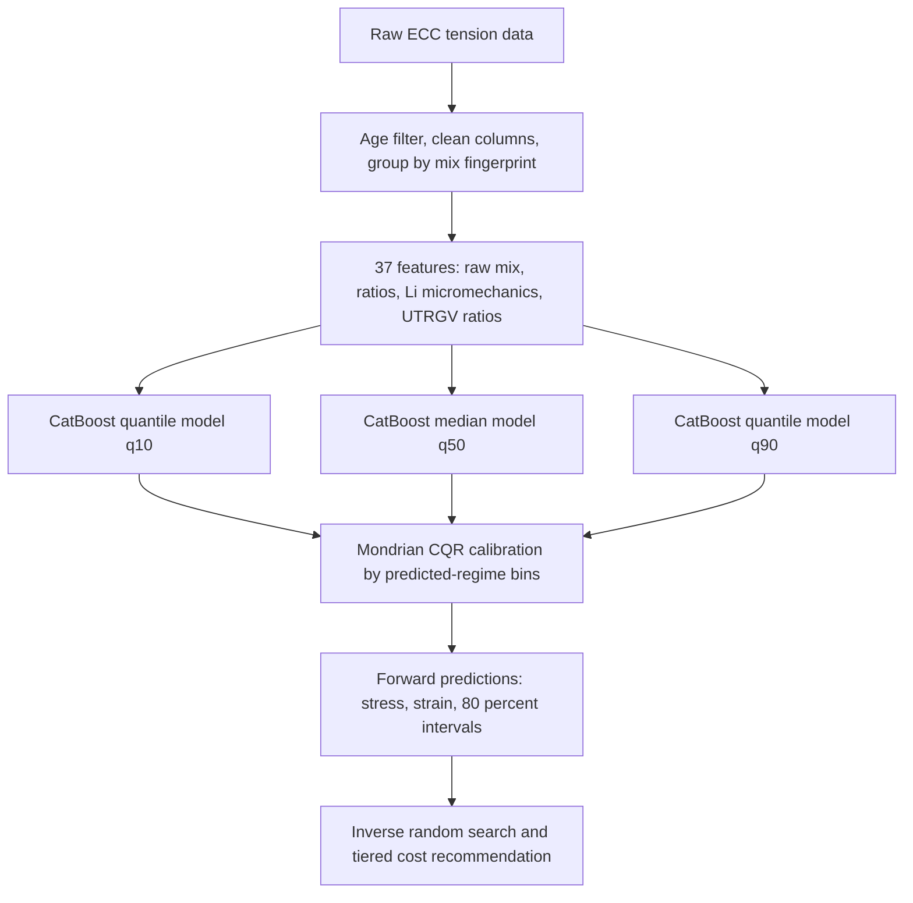
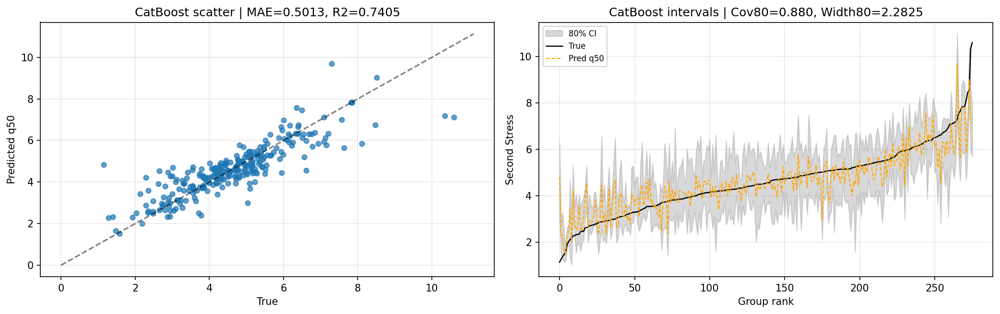
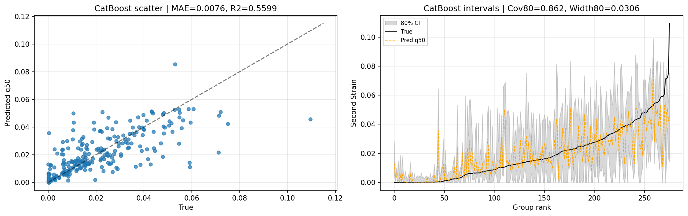
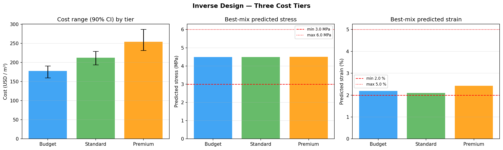

# ECC CatBoost Mondrian CQR

Notebook: `ECC_catboost_mondrian_cqr.ipynb`

## Architecture Diagram

## Methods

This notebook is the main CatBoost forward-model implementation. It predicts `Second Stress` and `Second Strain` using 37 engineered features from ECC mix composition, fiber descriptors, ratio features, and micromechanical proxy features.

The forward model trains three CatBoost regressors per target: lower quantile, median, and upper quantile. The raw quantile interval is then calibrated with Mondrian conformal quantile regression. GroupKFold is used so replicate specimens from the same mix do not leak across folds.

The inverse section uses the trained forward model to search for mixes that satisfy target windows, then ranks feasible candidates into Budget, Standard, and Premium tiers using cost and predicted performance.

## Results

| Target | MAE | RMSE | R2 | Cov80 | Width80 |
|---|---:|---:|---:|---:|---:|
| Second Stress | 0.5048 MPa | 0.7394 MPa | 0.7400 | 0.895 | 2.2856 MPa |
| Second Strain | 0.0073 | 0.0122 | 0.5555 | 0.855 | 0.0285 |

The inverse run found 24,069 feasible candidates out of 100,000 sampled candidates for the target stress range 3.0-6.0 MPa and strain range 2.0-5.0 percent. The tiered cost bands were approximately:

| Tier | 90 percent cost range |
|---|---:|
| Budget | 159.770-190.598 USD/m3 |
| Standard | 194.065-228.969 USD/m3 |
| Premium | 231.669-286.508 USD/m3 |

## Graphs

