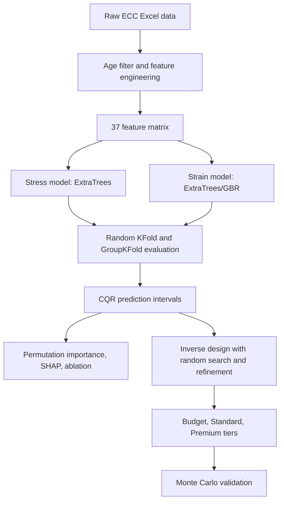

# Baseline ECC End-to-End Pipeline

Notebook: `ECC.ipynb`

## Architecture Diagram

## Methods

This is the older baseline end-to-end pipeline. It includes data filtering, 37-feature construction, honest GroupKFold evaluation, conformal quantile regression intervals, interpretability analysis, inverse design, and Monte Carlo validation.

It uses ExtraTrees and gradient boosting rather than CatBoost or the final MoE architecture. Because it compares Random KFold against GroupKFold, it is useful for showing how replicate leakage inflates apparent performance.

## Results

Forward evaluation:

| Target | Split | R2 | Spearman | MAE | RMSE |
|---|---|---:|---:|---:|---:|
| Stress | Random KFold | 0.8313 | 0.8722 | 0.451 MPa | 0.655 MPa |
| Stress | GroupKFold | 0.6268 | 0.7157 | 0.702 MPa | 0.974 MPa |
| Strain | Random KFold | 0.5844 | 0.7352 | 0.871 percent | 1.294 percent |
| Strain | GroupKFold | 0.3350 | 0.5633 | 1.190 percent | 1.637 percent |

80 percent CQR coverage was about 83.7 percent for stress and 77.6 percent for strain. The inverse design sampled 100,000 mixes, refined the top 50, and tiered 8,367 candidates. Cost points were about 168.24 USD/m3 for Budget, 214.14 USD/m3 for Standard, and 288.76 USD/m3 for Premium.

## Graphs

This notebook generates scatter plots, CQR interval plots, feature-importance plots, SHAP plots, inverse cost-tier plots, and Monte Carlo validation figures inline. No dedicated baseline PNG was present in `results/` at documentation time.

