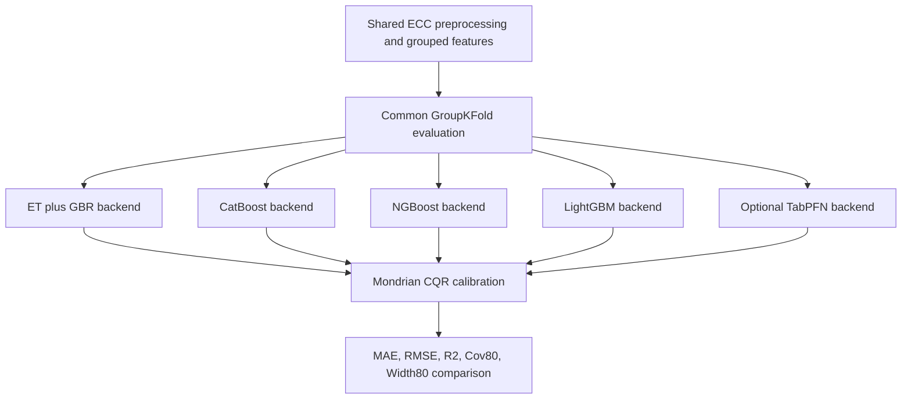

# Backend Comparison

Notebook: `backend_comparison.ipynb`

## Architecture Diagram

## Methods

This notebook compares multiple forward-model backends under the same grouped evaluation and Mondrian CQR calibration framework. It is designed to answer whether CatBoost, NGBoost, LightGBM, TabPFN, or the ET+GBR baseline gives the best calibrated prediction quality.

## Results

Captured strain comparison:

| Backend | MAE | RMSE | R2 | Cov80 | Width80 |
|---|---:|---:|---:|---:|---:|
| ET+GBR | 0.00772 | 0.01236 | 0.54698 | 0.81884 | 0.03749 |
| CatBoost | 0.00733 | 0.01225 | 0.55553 | 0.85507 | 0.02854 |
| NGBoost | 0.00782 | 0.01243 | 0.54209 | 0.89855 | 0.03433 |
| LightGBM | 0.01045 | 0.01607 | 0.23442 | 0.88043 | 0.03906 |

CatBoost gives the best strain MAE and the tightest intervals among the captured backends, while NGBoost gives the highest coverage with wider intervals.

## Graphs

This notebook creates backend metric bars and prediction/interval plots during execution. No dedicated backend comparison PNG was present in `results/` at documentation time.

