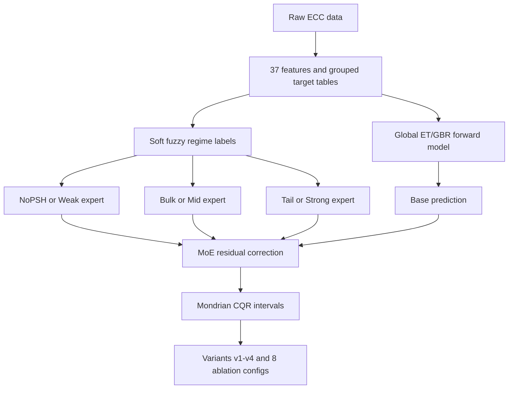

# Mondrian CQR MoE

Notebook: `mondrian_cqr_moe.ipynb`

## Architecture Diagram

## Methods

This notebook tests a Mondrian CQR mixture-of-experts forward architecture. It adds target-dependent fuzzy regime labels and residual experts to a global model, then evaluates four variants and eight expert-ablation configurations.

The variants are:

| Variant | Idea |
|---|---|
| v1 | Baseline MoE |
| v2 | Neighbor feature augmentation |
| v3 | Neighbor-aware Mondrian calibration |
| v4 | Heteroskedastic expert correction |

## Results

Cross-variant tuned A_Global comparison:

| Target | Variant | MAE | Cov80 | Width80 |
|---|---|---:|---:|---:|
| Second Strain | v1 | 0.00746 | 0.88406 | 0.03773 |
| Second Strain | v2 | 0.00746 | 0.88406 | 0.03773 |
| Second Strain | v3 | 0.00746 | 0.88768 | 0.03652 |
| Second Strain | v4 | 0.00746 | 0.88406 | 0.03773 |
| Second Stress | v1 | 0.49097 | 0.81159 | 2.49051 |
| Second Stress | v2 | 0.49097 | 0.81159 | 2.49051 |
| Second Stress | v3 | 0.49097 | 0.83696 | 2.51768 |
| Second Stress | v4 | 0.49097 | 0.81159 | 2.49051 |

Best tuned configurations:

| Target | Variant | Best config | MAE | Cov80 |
|---|---|---|---:|---:|
| Second Strain | v1-v4 | A_Global only | 0.00746 | 0.88406-0.88768 |
| Second Stress | v1 | B_Low only | 0.48812 | 0.79710 |
| Second Stress | v2-v4 | A_Global only | 0.49097 | 0.81159-0.83696 |

## Graphs

