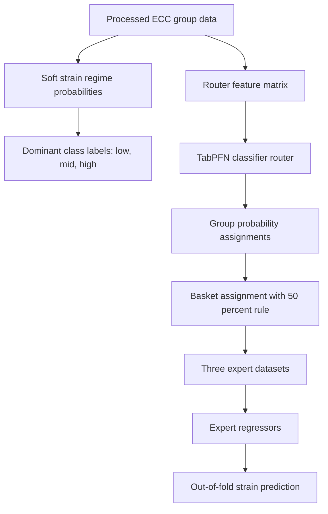

# TabPFN MoE Router

Notebook: `tabpfn_moe_router.ipynb`

## Architecture Diagram

## Methods

This notebook tests TabPFN as a classifier-style MoE router. It compresses the data to one row per group, rebuilds fuzzy strain labels, converts them to dominant classes, and evaluates TabPFN against a logistic-regression checkpoint.

If TabPFN wins the router checkpoint, the notebook uses it to assign raw rows into low/mid/high baskets and train expert models. The final evaluation focuses on out-of-fold `Second Strain` prediction.

## Results

Captured final pipeline metrics:

| Metric | Value |
|---|---:|
| Global OOF Pipeline MAE | 0.0117 |
| Global OOF Pipeline RMSE | 0.0170 |

These results are weaker than the CatBoost and MoE forward pipelines for strain, so this notebook is best read as a router experiment rather than the recommended production path.

## Graphs

The notebook creates router and expert evaluation graphs during execution. No dedicated TabPFN PNG was present in `results/` at documentation time.

